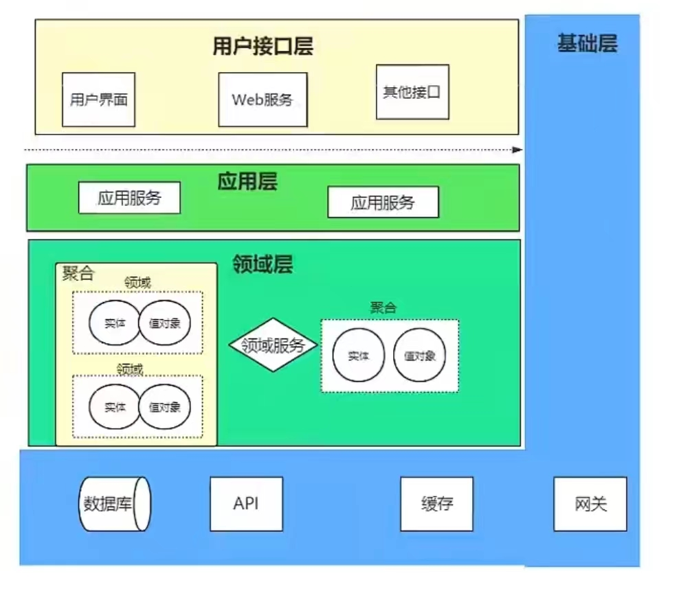

# 领域划分

DDD即Domain Drive Design，直译过来即“领域驱动设计”，它是一种围绕“领域”展开的系统架构。什么是领域？这是一个很抽象的概念，领域本质是一种边界，如何定义领域取决于如何定义边界，这是没有硬性标准的。打个比方，我可以将“贷前系统”作为一个领域，专门处理用户在提交贷款申请之前的信息填写业务；也可以将“审批系统”作为一个领域，专门处理提交贷款申请后的审批操作。接下来把粒度控制得更细一点，在贷前系统里，有处理个人信息如UserController、也有处理申请信息如ApplyInfoController，这些不同的Controller以及其Sevice、Mapper也是领域，反之亦然，这种领域的划分形成了代码之间的边界。

这时候就有疑问了，即使在MVC架构中，也会对某个业务划分专门的Controller、Service、Mapper，难道这样就是领域驱动设计了吗？其实在Controller层和Mapper层有点类似DDD，但是在Service层，单个领域无法完成业务，比如`申请信息`需要用到`用户信息`，我们一般做法是在ApplyInfoService依赖注入UserService，再通过UserService提供的API获取`用户信息`，从而继续走`申请信息`的业务流程。**这种使用方式符合单一职责原则，但不符合DDD的原则，因为它在Service层面破坏了领域的划分（引入其他Service）**。乍一听很违反直觉，这样也算破坏领域的划分？领域与领域既需要边界，也需要合作，而DDD架构正是对`边界`与`合作`做出了完美的取舍，至于怎么取舍放到后面讲。

在DDD的设计里，领域有3种：核心域、支撑域、通用域。

核心域：最体现业务特色、最具有业务价值的领域，也就是业务功能在系统中的体现。比如审批系统的审批逻辑，是整个领域的核心。

支撑域：有一定业务属性，但不太明显的领域。比如报表系统、日志系统，有一定业务价值，但即使不存在也不会影响业务主流程，属于开发优先级偏低的功能。

通用域：提供较为公共的功能，且业务属性很弱的领域。比如RBAC、ABAC权限控制。对于业务的影响小，甚至无需投入开发，采用现有的开源组件即可。

# 四层架构

领域层：不需要依赖任何外部组件，就能够完成业务。

基础层：提供业务属性的持久化功能，比如结果入库。

应用层：将领域层的业务能力进行组装，拼接成一个完成的业务流程。

用户接口层：提供外部的访问入口。

讲定义是最难懂的，举一个例子，转账场景：

1. A用户、B用户有各自的余额，A对B转账N元，A的余额-N，B的余额+N。对于账户领域来说，它需要拥有增加余额、减少余额的功能。
2. 起码从最基本的转账业务来说，账户领域就能够满足了，数据的变化发生在内存里，只要机器不宕机、不重启，也可以视作业务可靠。
3. 但账户领域只是保证最低限度的业务，在实际生产开发中，会加入基础层，将转账结果保存起来。**这也是为什么说领域层能够完成业务的原因。**
4. 至于应用层，可以理解为领域层的基础封装，通过继承领域层的功能来完成整套业务逻辑。
5. 最后是用户接口层，可以把他理解为Controller。