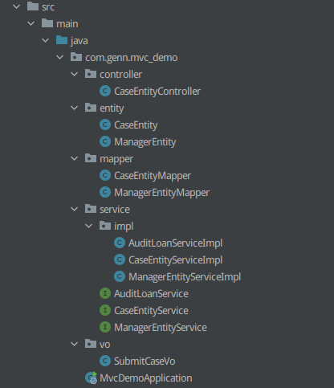

# MVC项目的准备

项目需求：

1. 作为贷前系统，客户填写完信息后，点击提交按钮。
2. 将案件推送给审批系统进行审批。
3. 调用审批成功后，将案件的状态改为“审批中”。
4. 调用审批成功后，将客户经理的案件数+1。
5. 将3.和4.的变化更新到数据库。

项目结构：



具体代码看MVC_Demo模块，这里面的代码有3个明显的问题：

1. 可维护性差，依赖第三方接口，第三方可能会改动，业务代码也要跟着改。
2. 可拓展性差，这种脚本式的写法填满了整个CaseEntityService#submit的逻辑，代码改动需要谨慎、代码复用比较难。假如后面新增了案件邀请人，又要在submit逻辑里填充。
3. 可测试性差，对于单独模块的测试，比如审批系统的调用，需要单独复制粘贴出来跑测试用例。

# 贫血模型与充血模型

我们日常开发中，定义Entity时更注重数据承载，实体只包含属性、属性getter、属性setter，然后在Service层通过使用getter、setter来完成Entity在业务上的属性变化。在DDD眼里，这种数据模型被称作`贫血模型`，从字面意思上可以理解为：这个模型自身很weak，需要Service层的协助才能发挥业务价值。

基于贫血模型引出了新的概念：贫血失忆症，它表明在贫血模型参与的业务开发中，随着业务的复杂性提升，贫血模型会定义更多的属性、更多的getter/setter。打个比方，贷前系统在后续的迭代中，需要新增`案件推荐人`的属性，我们往往会在CaseEntity里新增一个inviterId，然后在CaseEntityService引入InviterService，完成`案件`与`案件推荐人`的关联。在长久的迭代下，CaseEntity会新增更多Entity，CaseEntityService也会新增更多EntityService，**导致开发人员无法从CaseEntity这个实体里梳理数据的变化路线**，本来是为了承载业务而设计的实体，因为贫血模型，最终在实体中反而梳理不了业务。

为了改进贫血模型带来的失忆症问题，提出了`充血模型`的概念，充血模型的本质是：**将实体数据在变化的过程写在实体里，而不是简单地暴露getter和setter，**从而提升实体的业务表达能力，可以简单理解为：将Service层的业务含义或多或少地迁移到实体里。

充血模型是DDD里领域的一种实现方式，它和数据库表的设计并非完全相同。打个比方，对于`案件表`来说，它定义了案件ID、案件状态、案件客户经理ID、案件等级、创建时间、更改时间等等字段，但是对于`提交审批`这个业务来说，它只关心2个值：案件ID、案件状态、客户经理ID：

```java
public class CaseLoan {
    public Long caseId;
    public String caseStatus;
    public Long managerId;

    public void submitSuccess(){
        this.caseStatus = "2";
    }
}
```

这时候就有问题了：如果要操作案件客户经理的值呢？对于`提交审批业务`的`案件领域`来说，它只需要案件ID、案件状态、客户经理ID；如果 `提交审批业务`的`案件领域` 后续要迭代新的状态改变，在CaseLoan新加状态字段、新加状态变换方法就好了。但是如果要操作案件客户经理的数据，应该由客户经理的领域来负责，这意味着会有另一个充血模型的产生。比如MVC的需求提到：提交审批成功后，不仅要改案件的状态，还要改客户经理的案件数，因此除了`案件领域`外，`提交审批业务`还需要`客户经理领域`：

```java
public class ManagerLoan {
    public Integer caseCount;
    
    private void increaseCaseCount(Integer addend){
        this.caseCount = this.caseCount + addend;
    }
}
```

从 充血模型 和 Entity 的区别可以看出，`充血模型` 和 `表模型` 并没有强关联，充血对象 可以是 表模型 的一部分，也可以是多个表模型一部分的合成。那么在持久化操作时，不能简单地通过EntityMapper.insert(充血对象)的方式直接操作数据库，而是要额外封装一层，这一层就是`仓库`与`工厂`。 

# 仓库与工厂

仓库与工厂属于DDD四层架构里的基础层，提供充血模型的持久化操作，它和MVC架构中的Mapper不同的是，仓库使用Mapper或者其他持久化组件，完成充血模型的持久化操作，这样做的好处是，后续基础层发生任何变化比如MySQL换成Oracle、或者将查询交给Elasticsearch来做，只需修改仓库的方法即可，对于业务层是无感知的：

```java
public interface CaseLoanRepository{
    CaseLoan query(Long caseId);
    void save(CaseLoan caseLoan);
}

public class CaseLoanRepositoryImpl implements CaseLoanRepository{
    @Autowired
    private CaseEntityMapper caseEntityMapper;
    
    @Override
    public CaseLoan query(Long caseId){
        
    }
    
    @Override
    public void update(CaseLoan CaseLoan){
        
    }
}
```

如果后续想加入Redis作为持久化存储的一部分，只需在仓库加入RestTemplate、并且改动仓库的代码即可，对于业务层来说没有感知。但仅有仓库是不够的，上面说到 充血模型 和 表模型 的区别，我需要一个组件完成 充血模型 与 表模型 的转换，这个组件就是工厂（Builder）：

```JAVA
public interface CaseLoanRepository{
    CaseLoan query(Long caseId);
    void save(CaseLoan caseLoan);
}

public class CaseLoanRepositoryImpl implements CaseLoanRepository{
    @Autowired
    private CaseEntityMapper caseEntityMapper;
    @Autowired
    private CaseLoanBuilder caseLoanBuilder;
    
    @Override
    public CaseLoan query(Long caseId){
        CaseEntity caseEntity = caseEntityMapper.queryById(caseId);
        CaseLoan caseLoan = caseLoanBuilder.toCaseBasic(caseEntity);
        return caseLoan;
    }
    
    @Override
    public void update(CaseLoan CaseLoan){
        CaseEntity caseEntity = caseLoanBuilder.toCaseEntity(CaseLoan);
        caseEntityMapper.update(caseEntity);
    }
}
```

整合到业务代码里是这样的：

# 防腐层

我认为防腐层本质也是业务层，或者说业务层中调用外部接口的分支，它专门处理外部接口，通过封装外部接口的逻辑实现调用统一。但是，我认为它的核心思想是高内聚低耦合，并不是DDD的特点，即使在MVC架构中也会使用“防腐层”的设计降低外部接口与业务代码的耦合性。打个比方，在上面的调用审批系统代码中，可以将调用逻辑抽离出来：

# 领域服务

即DDD四层架构中的“业务层”，通过调用领域层的充血模型的业务API，组装出更丰富的业务。对于领域服务来说，最重要的作用是：调用领域层的业务方法，协调跨领域（充血）模型的数据交互。

